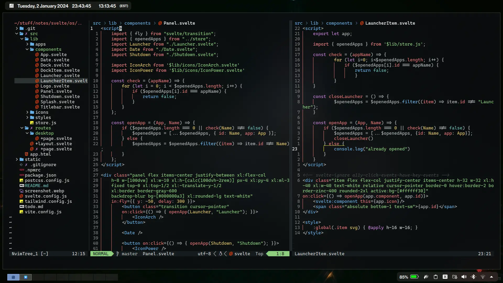

# nvim

~~still got a lot to do.~~  
~~lsp, yada yada yada.~~

## stuff

- font: [Caskaydia Code](https://github.com/ryanoasis/nerd-fonts/tree/master/patched-fonts/CascadiaCode)
- terminal: [konsole](https://konsole.kde.org)
- colorscheme: [everblush](https://github.com/everblush)

## plugins

- [lazy.nvim](https://github.com/folke/lazy.nvim)
- [nvim-colorizer.lua](https://github.com/norcalli/nvim-colorizer.lua)
- [nvim-tree.lua](https://github.com/nvim-tree/nvim-tree.lua)
- [nvim-autopairs](https://github.com/windwp/nvim-autopairs)
- [Comment.nvim](https://github.com/numToStr/Comment.nvim)
- [indent-blankline.nvim](https://github.com/lukas-reineke/indent-blankline.nvim)
- [nvim-treesitter](https://github.com/nvim-treesitter/nvim-treesitter)
- [barbecue.nvim](https://github.com/utilyre/barbecue.nvim)
- [telescope.nvim](https://github.com/nvim-telescope/telescope.nvim)
- [markdown-preview.nvim](https://github.com/iamcco/markdown-preview.nvim)
- [lualine.nvim](https://github.com/nvim-lualine/lualine.nvim)
- [lsp-zero.nvim](https://github.com/VonHeikemen/lsp-zero.nvim)
- [nvim-lspconfig](https://github.com/neovim/nvim-lspconfig)
- [nvim-cmp](https://github.com/hrsh7th/nvim-cmp)
- [williamboman/mason.nvim](https://github.com/williamboman/mason.nvim)
- [williamboman/mason-lspconfig.nvim](https://github.com/williamboman/mason-lspconfig.nvim)
- [akinsho/toggleterm.nvim](https://github.com/akinsho/toggleterm.nvim)
